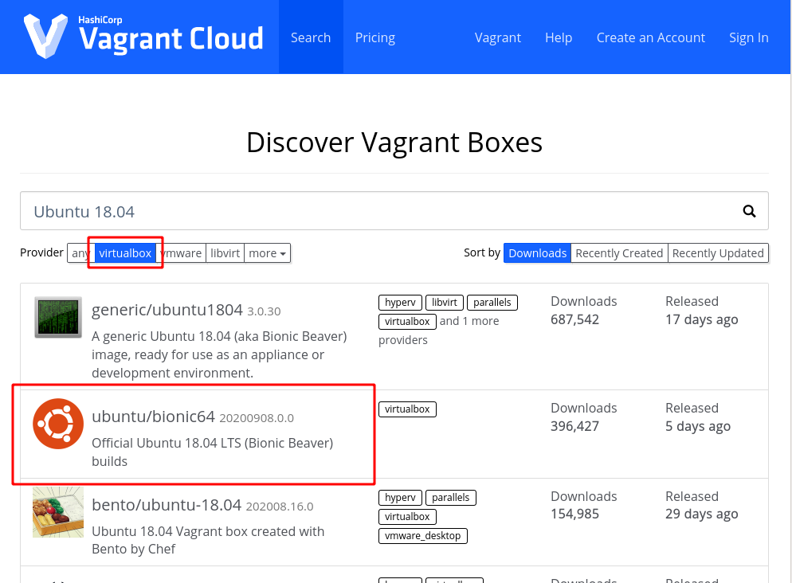
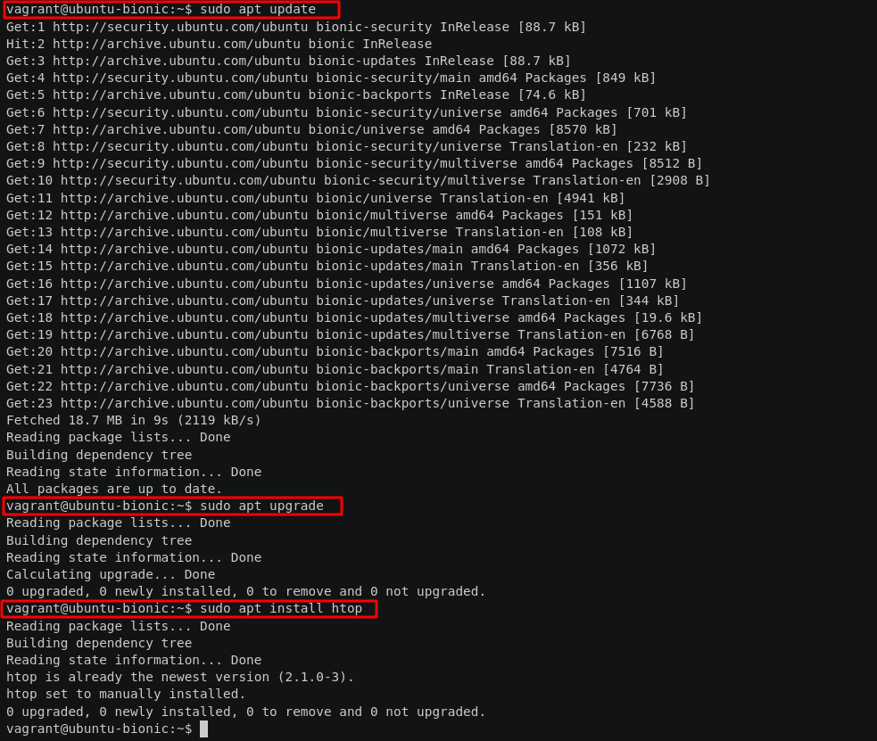

# (CSC-05) Lab 2 - Parte A: Virtualbox & Vagrant

Neste relatório serão descritos os passos realizados ao seguir o roteiro disponível para o _Laboratório 2 - Parte A: Virtualbox e Vagrant_.

A execução do laboratório foi gravada no formato _asciinema_ (gravação do terminal, sem intervalo entre comandos). Para cada subseção à seguir, serão disponibilizados os links referentes as gravações.

# Parte I: Introdução

## Gravação:
- Asciinema: [https://asciinema.org/a/359506](https://asciinema.org/a/359506)

## Ambiente

O Laboratório foi executado no seguinte ambiente:
- a
- b
- c


## Execução passo-a-passo:
A seguir, a execução dos passos do laboratório será seguida por _screenshots_ mostrando o resultado obtido para cada passo.

### 3) Verificar qual a versão do vagrant está instalada (no powershell ou cmder)

```
# vagrant version
```
---
No caso executei o Laboratório em um ambiente Linux (Arch Linux x64) e portanto utilizei uma linha de comando para o ambiente Linux.


### 4) Verificar as “boxes” instaladas
```
# vagrant box list
```
---


### 5) Criar um diretório com o nome “ubuntu18” e entrar nesse diretório
```
# cd Documentos
# mkdir ubuntu18
# cd ubuntu18
```
---


### 6) Criar um arquivo de inicialização do Vagrantfile
```
# vagrant init
```
---


### 7) Abrir em um editor de texto o arquivo Vagrantfile criado, entender
---
Segue abaixo uma imagem do conteúdo original do arquivo `Vagrantfile` estudado (aberto no editor `vim`)


### 8) Procurar por uma imagem útil para uso no VagrantCloud:
---

Link para o VagrantCloud: [https://app.vagrantup.com/boxes/search](https://app.vagrantup.com/boxes/search)



### 9) Usando editor de texto, modificar o “box” para ubuntu/bionic64
---


### 10) Após finalizar a edição, execute o comando, dentro da pasta ubuntu18
```
# vagrant up
```
---


### 11) Entre no virtualbox e verifique que sua maquina virtual esta rodando.
---


### 12) Vamos logar na maquina agora via SSH
```
# vagrant ssh
```
---


### 13) Dentro da máquina virtual verifique diversas características da VM
```
# free -h
# df -h
# sudo fdisk -l
```
---


### 14) Dentro da maquina virtual atualize o sistema e instale o htop
```
# sudo apt update
# sudo apt upgrade
# sudo apt install htop
```
---



Executando o `htop` só para verificar:


### 15) Saia da maquina guest VM de volta para o host
```
# exit
```
---


### 16) Verifique o estado da VM perante o vagrant
```
# vagrant status
```
---


### 17) Verificar as boxes instaladas
```
# vagrant box list
```
---


### 18) Desligue a maquina virtual de maneira "suave"
```
# vagrant halt
```
---


Verificando o estado da VM no VirtualBox:


### 19) Destrua / Limpe a VM e a box dentro dela, liberando espaço e recursos
```
# vagrant destroy
# vagrant box list
```
---


# Parte II: VM Windows

**Gravação**:
- Asciinema: [...](...)

A seguir, a execução dos passos do laboratório será seguida por _screenshots_ mostrando o resultado obtido para cada passo.

### 20) Crie um diretório “windows2010” em Documentos

### 21) Crie um arquivo Vagrantfile do zero contendo o código fornecido

### 22) Crie um segundo arquivo de texto com o nome “rdp.ps1” e coloque no mesmo diretório

### 23) Verifique o virtualbox novamente, veja a VM Windows rodando

### 24) Acionar o browser e instalar o "chocolatey"

### 25) Instale o browser "Firefox"

### 26) Reconfigurar a memoria para 1G RAM, alterando o arquivo Vagrantfile e testar recarregando essa configuração

### 27) Destruir a VM

# Parte III: "Mini-Cluster"

**Gravação**:
- Vídeo: [...](...)
- Asciinema: [...](...)

A seguir, a execução dos passos do laboratório será seguida por _screenshots_ mostrando o resultado obtido para cada passo.

### 28) Criar um novo diretório "doisubuntu"

### 29) Criar uma arquivo Vagrantfile novo contendo 2 maquinas virtuais

### 30) Acionar os ambientes no vagrant

### 31) Verificar o status e acessar cada uma das maquinas de maneira independente, e atualizar a maquina vm01, fazer teste de ping entre as maquinas

### 32) Atualizar o Vagrantfile e trocar o box da vm02 por bionic64. E Instalar apache2 na vm02

### 33) Testar acessar o servidor web com o browser a partir do Host e a partir do vm01 guest usando “wget” no Red Hat

### 34) Explorando um pouco dos "plug-ins" do Vagrant
