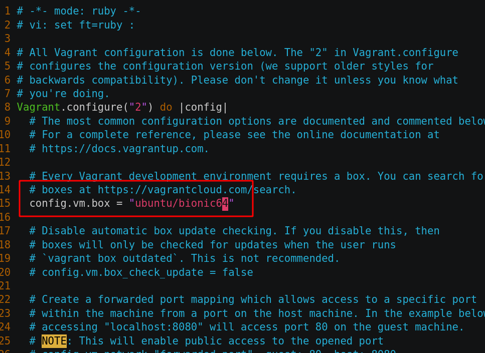
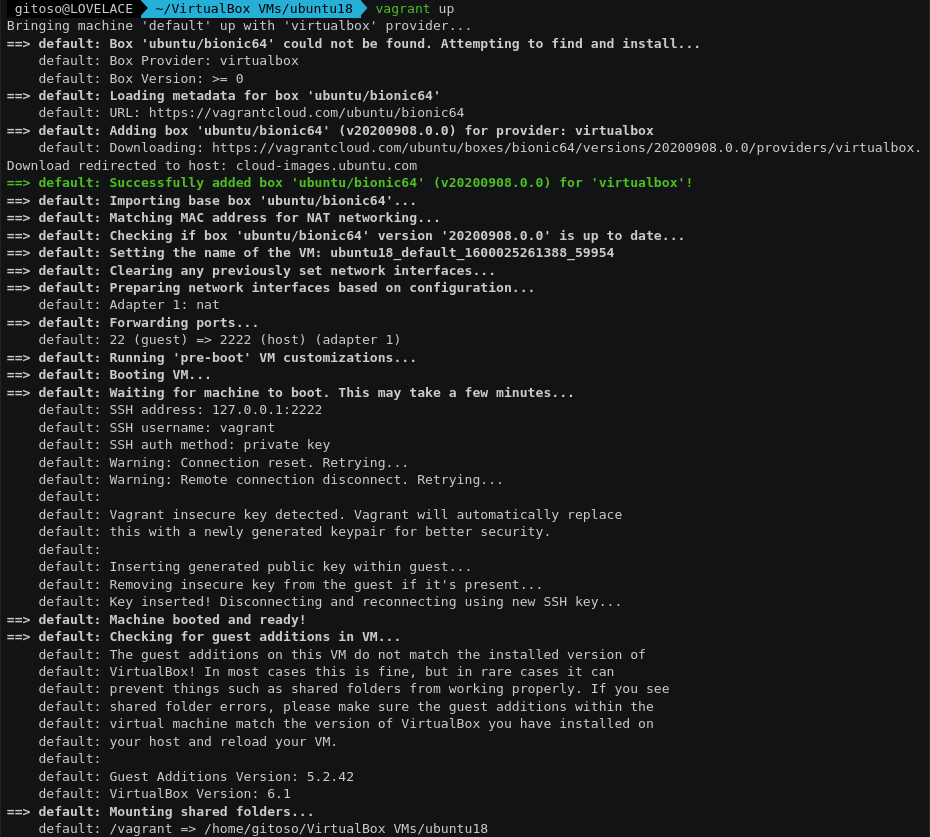
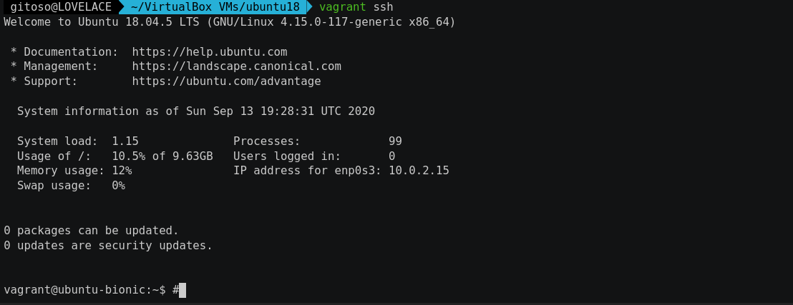
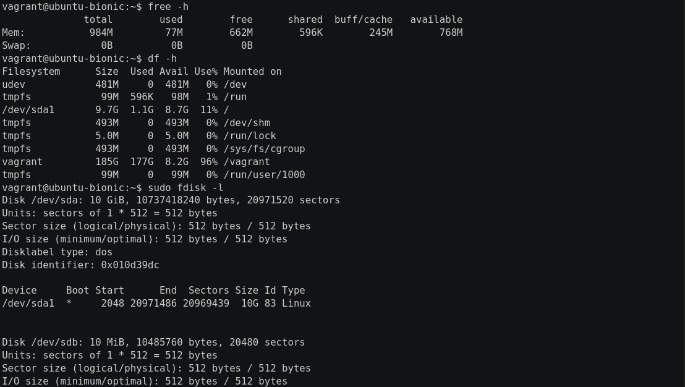
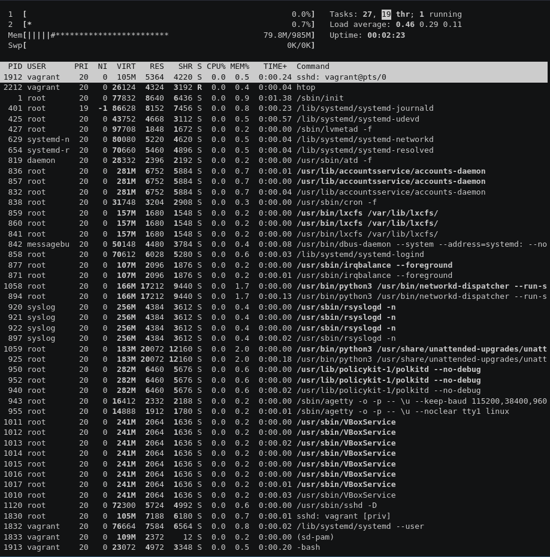
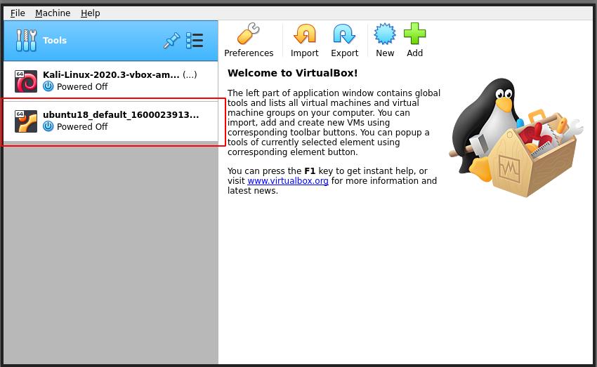

# (CSC-05) Lab 2 - Parte A: Virtualbox & Vagrant

Neste relatório serão descritos os passos realizados ao seguir o roteiro disponível para o _Laboratório 2 - Parte A: Virtualbox e Vagrant_.

A execução do laboratório foi gravada no formato _asciinema_ (gravação do terminal, sem intervalo entre comandos). Para cada subseção à seguir, serão disponibilizados os links referentes as gravações.

O Laboratório foi executado no seguinte ambiente:
- **Sistema Operacional**: Arch Linux (x64)
    - **Kernel**: 5.8.8-arch1-1
- **CPU**: Intel i7-6500U
- **RAM**: 8 GB
- **GPU**: Intel Skylake GT2 [HD Graphics 520]


**Tabela de Conteúdos**:
<!-- vscode-markdown-toc -->
* [Parte I: Introdução](#ParteI:Introduo)
	* [Gravação:](#Gravao:)
	* [Execução passo-a-passo:](#Execuopasso-a-passo:)
* [Parte II: VM Windows](#ParteII:VMWindows)
	* [Gravação](#Gravao)
	* [Execução passo-a-passo](#Execuopasso-a-passo)
* [Parte III: "Mini-Cluster"](#ParteIII:Mini-Cluster)
	* [Gravação](#Gravao-1)
	* [Execução passo-a-passo](#Execuopasso-a-passo-1)

<!-- vscode-markdown-toc-config
	numbering=false
	autoSave=true
	/vscode-markdown-toc-config -->
<!-- /vscode-markdown-toc -->

---


## <a name='ParteI:Introduo'></a>Parte I: Introdução

### <a name='Gravao:'></a>Gravação:
- Asciinema: [https://asciinema.org/a/359506](https://asciinema.org/a/359506)


### <a name='Execuopasso-a-passo:'></a>Execução passo-a-passo:
A seguir, a execução dos passos do laboratório será seguida por _screenshots_ mostrando o resultado obtido para cada passo.

#### <a name='Verificarqualaversodovagrantestinstaladanopowershelloucmder'></a>3) Verificar qual a versão do vagrant está instalada (no powershell ou cmder)

```
# vagrant version
```
---
No caso executei o Laboratório em um ambiente Linux (Arch Linux x64) e portanto utilizei uma linha de comando para o ambiente Linux.


#### <a name='Verificarasboxesinstaladas'></a>4) Verificar as “boxes” instaladas
```
# vagrant box list
```
---


#### <a name='Criarumdiretriocomonomeubuntu18eentrarnessediretrio'></a>5) Criar um diretório com o nome “ubuntu18” e entrar nesse diretório
```
# cd Documentos
# mkdir ubuntu18
# cd ubuntu18
```
---


#### <a name='CriarumarquivodeinicializaodoVagrantfile'></a>6) Criar um arquivo de inicialização do Vagrantfile
```
# vagrant init
```
---


#### <a name='AbriremumeditordetextooarquivoVagrantfilecriadoentender'></a>7) Abrir em um editor de texto o arquivo Vagrantfile criado, entender
---
Segue abaixo uma imagem do conteúdo original do arquivo `Vagrantfile` estudado (aberto no editor `vim`)


#### <a name='ProcurarporumaimagemtilparausonoVagrantCloud:'></a>8) Procurar por uma imagem útil para uso no VagrantCloud:
---

Link para o VagrantCloud: [https://app.vagrantup.com/boxes/search](https://app.vagrantup.com/boxes/search)


#### <a name='Usandoeditordetextomodificaroboxparaubuntubionic64'></a>9) Usando editor de texto, modificar o “box” para ubuntu/bionic64
---



#### <a name='Apsfinalizaraedioexecuteocomandodentrodapastaubuntu18'></a>10) Após finalizar a edição, execute o comando, dentro da pasta ubuntu18
```
# vagrant up
```
---


#### <a name='Entrenovirtualboxeverifiquequesuamaquinavirtualestarodando.'></a>11) Entre no virtualbox e verifique que sua maquina virtual esta rodando.
---


#### <a name='VamoslogarnamaquinaagoraviaSSH'></a>12) Vamos logar na maquina agora via SSH
```
# vagrant ssh
```
---



#### <a name='DentrodamquinavirtualverifiquediversascaractersticasdaVM'></a>13) Dentro da máquina virtual verifique diversas características da VM
```
# free -h
# df -h
# sudo fdisk -l
```
---



#### <a name='Dentrodamaquinavirtualatualizeosistemaeinstaleohtop'></a>14) Dentro da maquina virtual atualize o sistema e instale o htop
```
# sudo apt update
# sudo apt upgrade
# sudo apt install htop
```
---


Executando o `htop` só para verificar:



#### <a name='SaiadamaquinaguestVMdevoltaparaohost'></a>15) Saia da maquina guest VM de volta para o host
```
# exit
```
---


#### <a name='VerifiqueoestadodaVMperanteovagrant'></a>16) Verifique o estado da VM perante o vagrant
```
# vagrant status
```
---


#### <a name='Verificarasboxesinstaladas-1'></a>17) Verificar as boxes instaladas
```
# vagrant box list
```
---


#### <a name='Desligueamaquinavirtualdemaneirasuave'></a>18) Desligue a maquina virtual de maneira "suave"
```
# vagrant halt
```
---


Verificando o estado da VM no VirtualBox:



#### <a name='DestruaLimpeaVMeaboxdentrodelaliberandoespaoerecursos'></a>19) Destrua / Limpe a VM e a box dentro dela, liberando espaço e recursos
```
# vagrant destroy
# vagrant box list
```
---


## <a name='ParteII:VMWindows'></a>Parte II: VM Windows

### <a name='Gravao'></a>Gravação
- Asciinema: [...](...)

A seguir, a execução dos passos do laboratório será seguida por _screenshots_ mostrando o resultado obtido para cada passo.

### <a name='Execuopasso-a-passo'></a>Execução passo-a-passo

#### <a name='Crieumdiretriowindows2010emDocumentos'></a>20) Crie um diretório “windows2010” em Documentos

#### <a name='CrieumarquivoVagrantfiledozerocontendoocdigofornecido'></a>21) Crie um arquivo Vagrantfile do zero contendo o código fornecido

#### <a name='Crieumsegundoarquivodetextocomonomerdp.ps1ecoloquenomesmodiretrio'></a>22) Crie um segundo arquivo de texto com o nome “rdp.ps1” e coloque no mesmo diretório

#### <a name='VerifiqueovirtualboxnovamentevejaaVMWindowsrodando'></a>23) Verifique o virtualbox novamente, veja a VM Windows rodando

#### <a name='Acionarobrowsereinstalarochocolatey'></a>24) Acionar o browser e instalar o "chocolatey"

#### <a name='InstaleobrowserFirefox'></a>25) Instale o browser "Firefox"

#### <a name='Reconfiguraramemoriapara1GRAMalterandooarquivoVagrantfileetestarrecarregandoessaconfigurao'></a>26) Reconfigurar a memoria para 1G RAM, alterando o arquivo Vagrantfile e testar recarregando essa configuração

#### <a name='DestruiraVM'></a>27) Destruir a VM

## <a name='ParteIII:Mini-Cluster'></a>Parte III: "Mini-Cluster"

### <a name='Gravao-1'></a>Gravação
- Asciinema: [...](...)

A seguir, a execução dos passos do laboratório será seguida por _screenshots_ mostrando o resultado obtido para cada passo.

### <a name='Execuopasso-a-passo-1'></a>Execução passo-a-passo

#### <a name='Criarumnovodiretriodoisubuntu'></a>28) Criar um novo diretório "doisubuntu"

#### <a name='CriarumaarquivoVagrantfilenovocontendo2maquinasvirtuais'></a>29) Criar uma arquivo Vagrantfile novo contendo 2 maquinas virtuais

#### <a name='Acionarosambientesnovagrant'></a>30) Acionar os ambientes no vagrant

#### <a name='Verificarostatuseacessarcadaumadasmaquinasdemaneiraindependenteeatualizaramaquinavm01fazertestedepingentreasmaquinas'></a>31) Verificar o status e acessar cada uma das maquinas de maneira independente, e atualizar a maquina vm01, fazer teste de ping entre as maquinas

#### <a name='AtualizaroVagrantfileetrocaroboxdavm02porbionic64.EInstalarapache2navm02'></a>32) Atualizar o Vagrantfile e trocar o box da vm02 por bionic64. E Instalar apache2 na vm02

#### <a name='TestaracessaroservidorwebcomobrowserapartirdoHosteapartirdovm01guestusandowgetnoRedHat'></a>33) Testar acessar o servidor web com o browser a partir do Host e a partir do vm01 guest usando “wget” no Red Hat

#### <a name='Explorandoumpoucodosplug-insdoVagrant'></a>34) Explorando um pouco dos "plug-ins" do Vagrant
